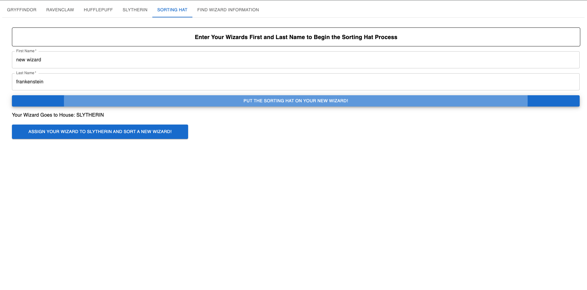

# Documentation

## Project Summary

    This project utilizes key-value pair data using json server as the back end
    paired with a React front end and Material UI for design.
    The theme is based off of a book series: Harry Potter.
    In this project user(s) will be able to manipulate data for Wizards.
        Check the 'Features Completed' section for what features exist.

## Below are some images of the UI for an over view.

**_ note: due to a time limit, UI may not look as robust and appealing _**

#### Creating a Wizard

#### Show Wizards in a Data Grid

#### Find a Wizard's information

## Front End Set Up

    1) run 'npm install' in root directory of project /app to install all tools
    2) run 'npm start' to start the React project
    3) it should automatically start in your browser if you have a tab open,
    if not, navigate to 'http://localhost:3000'
    4) You won't see data if you start the front end first, so move on to
    the next steps and start up your back end

## Back End Set Up

    1) cd in to the 'server' folder
    *** located in app/server/ ***
    1.2) run 'json-server --watch database.json --port 8080'
    *** this will start the server in your localhost/8080 ***
    1.3) The URL to visit in development is under 'Resources'
         For example: 'http://localhost:8080/wizards'
    2) endpoint details:
        GET /wizards - get all wizards
        GET /wizards/{id} - get wizard by ID
        POST /wizards - create a new wizard, ID is automatically generated
        PUT /wizards/{id} - edit a wizard by ID
        PATCH /wizards/{id} - patch a wizard by ID
        DELETE /wizards/{id} - delete a wizard by ID
    *** you can test the endpoints by utilizing programs like Postman/Incomnia ***
    3) data object structure example:  {
                              "id": int,
                              "first_name": "string",
                              "last_name": "string",
                              "email": "string", // first_name.last_name@hogwarts.com
                              "house": "string" // gryffindor, ravenclaw, hufflepuff, slytherin
                            }

# Features Completed + Instructions

    1) Get all Wizards and display in a Data Grid in their own House Tabs
        a) click any of the tabs for the Hogwarts House (GRYFFINDOR, RAVENCLAW,
        HUFFLEPUFF, SLYTHERIN)
        b) you may need to refresh and/or click a different tab and click the tab again
        c) each tab consits of a Data Grid with the Wizards that belong in that house
    1.2) Get all the data from a selected Wizard in a drop down list
        a) go to the 'FIND WIZARD INFORMATION' tab
        b) click on the 'Wizard Names' drop down and select any name with you mouse
        c) once you select a name, the Wizard's data will pop down below the selector
    2) Delete a wizard from database and remove row from Data Grid
        a) navigate to any house and click the 'delete' icon next to any wizard
        b) you will get an alert for a success/failure of Wizard deletion
        c) you may need to refresh and come back to the tab you delete the Wizard
        from to see the updates
    3) Create a New Wizard
        a) navigate to 'SORTING HAT'
        *** in the movies, you will see Wizards lined up in the dining hall
        to wear the Sorting Hat to tell them which house they belong to. ***
        c) here you are required to type in a 'First Name' and a 'Last Name'
        d) this will then enable the 'PUT THE SORTING HAT ON YOUR NEW WIZARD' button
        e) click the button once you are satisfied with the first and last name of the Wizard
        f) You will then see that the Sorting Hat has randomized the Wizard to one of the four houses.
        *** Users are able to shuffle to their hearts content for what house there is,
        but this is not how the story line goes :) I left it enabled for
        those that want to be Gryffindor but end up something else.... Like me.... A RavenClawERR ***
        g) once satisfied, click the 'ASSIGN YOUR WIZARD TO ---- AND SORT A NEW WIZARD!'
        h) this will clear all the info in the form and allow you to restart
        the process for the next Wizard!

    Stretch Goals
        1) add testing with React Testing Library
        2) add confirm delete when deleting a wizard
        3) enable PUT/PATCH features

## Available Scripts

In the project directory, you can run:

### `npm start`

Runs the app in the development mode.\
Open [http://localhost:3000](http://localhost:3000) to view it in your browser.

The page will reload when you make changes.\
You may also see any lint errors in the console.

### `npm test`

Launches the test runner in the interactive watch mode.\
See the section about [running tests](https://facebook.github.io/create-react-app/docs/running-tests) for more information.

### `npm run build`

Builds the app for production to the `build` folder.\
It correctly bundles React in production mode and optimizes the build for the best performance.

The build is minified and the filenames include the hashes.\
Your app is ready to be deployed!

See the section about [deployment](https://facebook.github.io/create-react-app/docs/deployment) for more information.

### `npm run eject`

**Note: this is a one-way operation. Once you `eject`, you can't go back!**

If you aren't satisfied with the build tool and configuration choices, you can `eject` at any time. This command will remove the single build dependency from your project.

Instead, it will copy all the configuration files and the transitive dependencies (webpack, Babel, ESLint, etc) right into your project so you have full control over them. All of the commands except `eject` will still work, but they will point to the copied scripts so you can tweak them. At this point you're on your own.

You don't have to ever use `eject`. The curated feature set is suitable for small and middle deployments, and you shouldn't feel obligated to use this feature. However we understand that this tool wouldn't be useful if you couldn't customize it when you are ready for it.

## Learn More

You can learn more in the [Create React App documentation](https://facebook.github.io/create-react-app/docs/getting-started).
To learn React, check out the [React documentation](https://reactjs.org/).
